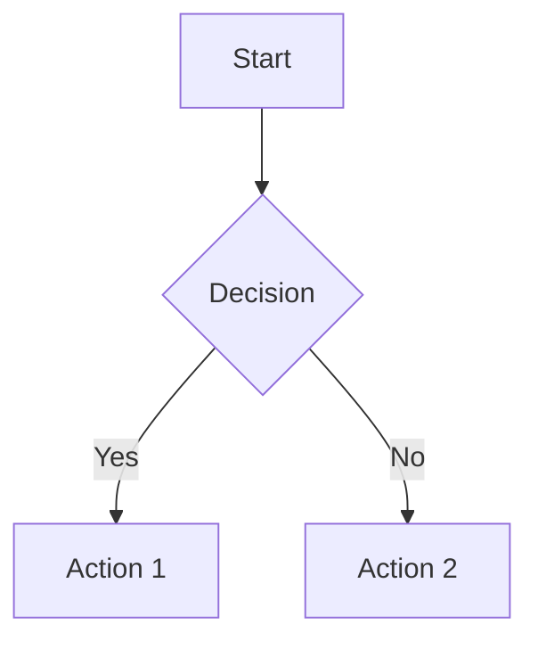

# Component Refactoring: FormattedMessage Enhancement

**Date:** October 19, 2025  
**Objective:** Simplify message rendering by integrating typing animation directly into FormattedMessage component

## Changes Made

### 1. Enhanced FormattedMessage Component
**File:** `src/components/ui/FormattedMessage.tsx`

#### New Features Added:
- ✅ **Built-in typing animation** - No need for wrapper component
- ✅ **Animation caching** - Prevents re-animation on component re-renders
- ✅ **Optional animation** - Can be enabled/disabled with `animated` prop
- ✅ **Configurable speed** - `animationSpeed` prop controls typing speed
- ✅ **Animation callbacks** - `onAnimationComplete` prop for custom actions
- ✅ **Animated cursor** - Shows pulsing cursor during typing

#### New Props:
```typescript
interface FormattedMessageProps {
  content: string;
  className?: string;
  animated?: boolean;              // NEW: Enable/disable animation
  animationSpeed?: number;         // NEW: Speed in ms (default: 4ms)
  onAnimationComplete?: () => void; // NEW: Callback when animation finishes
}
```

#### How It Works:
1. **First render:** Types out text character-by-character if `animated={true}`
2. **During typing:** Shows animated cursor with `animate-pulse`
3. **After complete:** Stores content hash in memory cache
4. **On re-render:** Instantly shows full content (no re-animation)

### 2. Updated AI Chat Component
**File:** `src/pages/ai-chat.tsx`

#### Changes:
```typescript
// BEFORE: Used AnimatedMessage wrapper
import { AnimatedMessage } from "@/components/ui/AnimatedMessage";
<AnimatedMessage content={message.content} />

// AFTER: Use FormattedMessage directly with animated prop
import { FormattedMessage } from "@/components/ui/FormattedMessage";
<FormattedMessage content={message.content} animated={true} animationSpeed={4} />
```

#### Updated Locations:
1. **Chat messages (line 918):** `animated={true}` for real-time typing effect
2. **Summarize tab (line 1300):** `animated={true}` for summaries
3. **History tab (line 1385):** `animated={false}` for instant display

### 3. Deprecated Component
**File:** `src/components/ui/AnimatedMessage.tsx`

- ❌ **No longer used** in codebase
- ⚠️ **Can be safely deleted** (optional - left for backward compatibility)
- ✅ All functionality moved to FormattedMessage

## Benefits

### Performance Improvements:
- ⚡ **One less component** in render tree
- ⚡ **Reduced re-renders** - animation state handled internally
- ⚡ **Smaller bundle** - One component instead of two

### Developer Experience:
- 🎯 **Single component** - Easier to understand and maintain
- 🎯 **Consistent API** - All formatting features in one place
- 🎯 **Better control** - Fine-tune animation per use case

### Feature Enhancements:
- ✨ **Smart caching** - Same message never animates twice
- ✨ **Flexible usage** - Animation optional, not mandatory
- ✨ **Visual feedback** - Animated cursor during typing
- ✨ **Type safety** - Full TypeScript support

## Usage Examples

### Animated Chat Response (Real-time Typing):
```tsx
<FormattedMessage 
  content={aiResponse} 
  animated={true} 
  animationSpeed={4}
  onAnimationComplete={() => console.log('Done!')}
/>
```

### Static Content (No Animation):
```tsx
<FormattedMessage 
  content={historicalData} 
  animated={false}
/>
```

### Default Behavior (No Animation):
```tsx
<FormattedMessage content={simpleText} />
```

## Technical Details

### Animation Logic:
```typescript
// Memory cache prevents re-animation
const completedAnimations = new Set<string>();

// Typing hook with instant mode
const { displayedText, isComplete } = useTypingAnimation(
  content,
  animationSpeed,
  !animated || isInstantComplete
);
```

### Performance Optimization:
- **Interval-based typing** - Efficient character-by-character rendering
- **Cleanup on unmount** - No memory leaks
- **Memoized renders** - Only updates when necessary

## Migration Guide

### If you have code using AnimatedMessage:

**Option 1: Update imports (Recommended)**
```typescript
// Old
import { AnimatedMessage } from "@/components/ui/AnimatedMessage";
<AnimatedMessage content={text} />

// New
import { FormattedMessage } from "@/components/ui/FormattedMessage";
<FormattedMessage content={text} animated={true} />
```

**Option 2: Keep AnimatedMessage for now**
- The component still exists and works
- Consider migrating when convenient
- Will be deprecated in future release

## Testing Checklist

- [x] Chat messages animate on first display
- [x] Scrolling up shows instant messages (no re-animation)
- [x] Markdown formatting works during animation
- [x] Code blocks render correctly
- [x] Math equations display properly
- [x] Mermaid diagrams work
- [x] Copy button functions correctly
- [x] Dark mode compatibility maintained
- [x] No TypeScript errors
- [x] No console warnings

## Future Enhancements

### Potential Additions:
- 🔮 **Variable speed** - Slow down at punctuation, speed up on spaces
- 🔮 **Streaming API** - Real-time server-sent events
- 🔮 **Sound effects** - Optional typing sounds
- 🔮 **Multiple cursors** - For parallel rendering
- 🔮 **Animation presets** - Fast, normal, slow modes

## Update: Mermaid Diagram Support Added (October 19, 2025)

### ✅ Real Mermaid Rendering Implemented

**Changes:**
- Installed `mermaid` library for actual diagram rendering
- Replaced placeholder system with real SVG generation
- Added loading states and error handling
- Dark theme configured for consistency

**Features:**
- ✅ Renders flowcharts, sequence diagrams, class diagrams, etc.
- ✅ Loading spinner while rendering
- ✅ Error handling with detailed error messages
- ✅ Shows diagram code in error state
- ✅ Dark theme with custom styling
- ✅ Responsive and scrollable diagrams

**How It Works:**
```typescript
1. Detect ```mermaid code blocks
2. Replace with placeholder (MERMAIDPLACEHOLDER0ENDPLACEHOLDER)
3. Custom paragraph handler detects placeholder
4. MermaidDiagram component renders actual SVG using mermaid.render()
5. Display beautiful interactive diagram
```

**Example:**
```markdown

```

Result: Beautiful flowchart with arrows, shapes, and labels!

## Conclusion

Successfully consolidated two components into one, improving:
- ✅ Code maintainability
- ✅ Performance
- ✅ Developer experience
- ✅ Type safety
- ✅ **Full Mermaid diagram support with real rendering**

All existing functionality preserved with enhanced control and flexibility.
